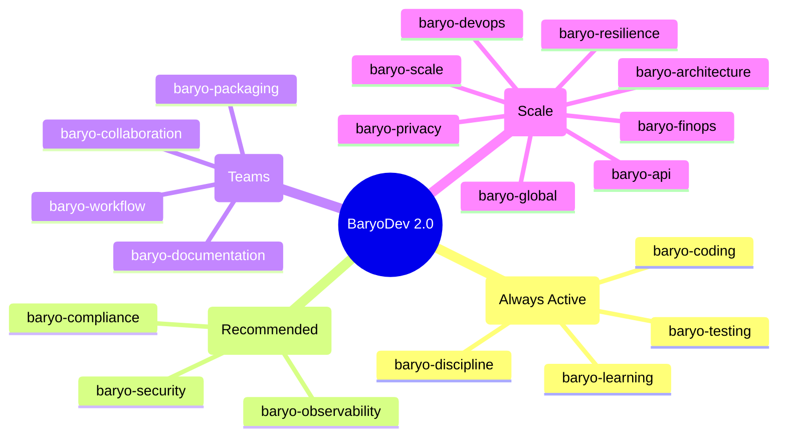
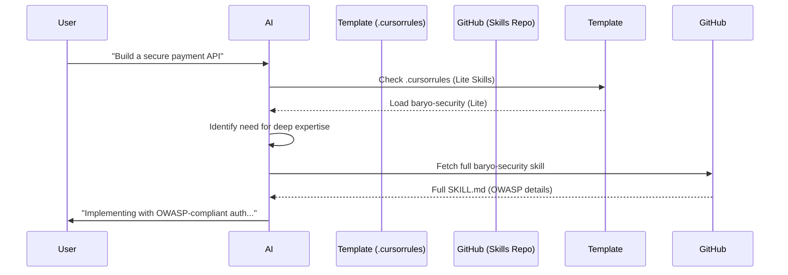

# BaryoDev 2.0: The Enterprise-Grade AI Engineering Framework

**How we built a self-improving, token-efficient, and worldwide-standard system for production AI development.**

---

In my last post, I introduced the "Baryo Way"—a philosophy of performance, discipline, and zero-external dependencies. Today, we are taking it to the next level. 

We’ve just released **BaryoDev 2.0**, expanding from a handful of coding rules to a complete **Enterprise AI Skill Suite** featuring 19 specialized skills, worldwide standards compliance, and a revolutionary **Smart Loading System** that saves up to 80% on token costs.

---

## The 19-Skill Ecosystem

One of the biggest problems with AI coding is "vibe coding"—where the AI writes code that looks right but fails the rigors of production. BaryoDev solves this by codifying expertise into 19 distinct skills organized into four categories:

From **OWASP Top 10 security** to **GDPR privacy** and **WCAG 2.1 accessibility**, every skill is designed to be language-agnostic and enterprise-ready.

---

## The Token Optimization Problem

As the skill library grew, we hit a wall: **Context Overflow.** Loading 19 full skills into an AI session consumed over 16,000 tokens—leaving little room for code and driving up costs.

Our solution? **Smart Skill Loading.**

We created **BaryoDev Skills Lite**—a condensed summary of all 19 skills that stays under 2,500 tokens. When the AI needs deep expertise, it dynamically fetches the full documentation using a dedicated fetcher script.

---

## Self-Healing AI: The Learning Loop

BaryoDev 2.0 introduces **Continuous AI Learning**. When the AI makes a mistake or learns a new pattern from your project, it documents it, audits the root cause, and proposes a skill update.

With your approval, the AI then creates a **Pull Request** to the central [BaryoDev/skills](https://github.com/BaryoDev/skills) repository. Every developer using the framework becomes a contributor, making the entire community's AI smarter every day.

---

## 🙋‍♂️ Q&A: Everything You Need to Know

### Q: Is this only for .NET developers?
**A:** No! While we started with .NET projects (Carom, Mapsicle, Verdict), the enterprise suite is designed to be **paradigm-agnostic**. The rules for security, observability, and scaling apply to TypeScript, Go, Rust, Python, and more.

### Q: How much does this actually save on tokens?
**A:** By using the "Lite" version in `.cursorrules`, you save approx. **85% on initial token consumption** (from 16k to 2.5k). Full skills are only fetched when a specific task demands deep expertise.

### Q: Does the AI really "fix" itself?
**A:** Yes. Under the `baryo-learning` skill, the AI tracks its own mistakes in `.baryo/mistakes/`. It analyzes why it failed (e.g., "Hallucinated an API") and drafts a specific instruction to prevent it next time.

### Q: How do I get started?
**A:** You can use our [Template Project](https://github.com/BaryoDev/template-project) as a "Startup in a Box." It comes pre-configured with the smart loading system, VitePress docs, and GitHub templates.

---

## The Vision: Collective Engineering Intelligence

BaryoDev isn't just a set of files; it's a **neighborhood** (Baryo) of developers and AI agents sharing standards. By codifying discipline and worldwide standards into reusable skills, we are making production-grade engineering accessible to everyone—from solo hackers to enterprise teams.

**Join the movement:**
🚀 **Template**: [github.com/BaryoDev/template-project](https://github.com/BaryoDev/template-project)
🏘️ **Skills**: [github.com/BaryoDev/skills](https://github.com/BaryoDev/skills)

---
#BuildInPublic #AI #SoftwareEngineering #OpenSource #Productivity
